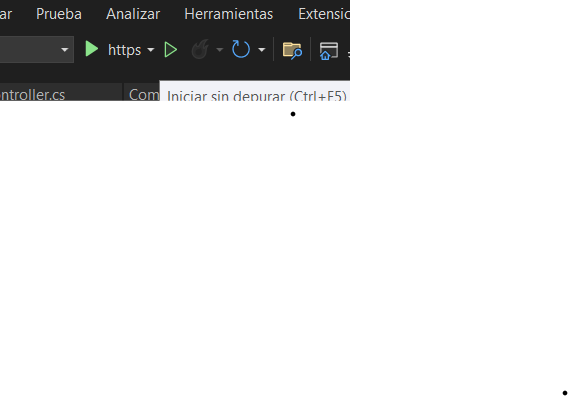
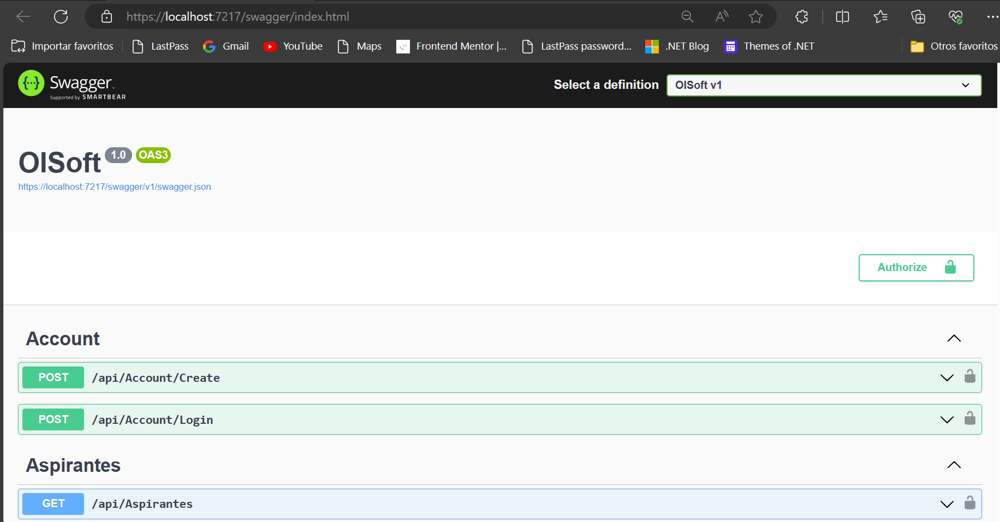

# OLSOFtware

## Technologías

Data Base MS-SQL Server 16
Backend .NET 6.0

#### Paquetes o dependencias usadas en este projecto

<ul>
    <li>"AutoMapper.Extensions.Microsoft.DependencyInjection" Version="12.0.1"</li>
    <li>"Microsoft.AspNetCore.Authentication.JwtBearer" Version="6.0.25"</li>
    <li>"Microsoft.AspNetCore.Identity.EntityFrameworkCore" Version="6.0.25"</li>
    <li>"Microsoft.EntityFrameworkCore" Version="6.0.25"</li>
    <li>"Microsoft.EntityFrameworkCore.SqlServer" Version="6.0.25"</li>
    <li>"Microsoft.EntityFrameworkCore.Tools" Version="6.0.25"</li>
    <li>"Microsoft.VisualStudio.Web.CodeGeneration.Design" Version="6.0.16"</li>
    <li>"Swashbuckle.AspNetCore" Version="6.5.0"</li>
</ul>

## Arquitectura 

## MVC

## Ejecutar el Projecto:

Para ejecutar este projecto clona este repositorio <a>https://github.com/RobARC/OLSoftware.git</a> y 
abrelo con Visual Studio 2022 y haces click en el boton https.

Importante tener instalado el SDK 6.0.417 y los paquetes arriba mencionados.

## Ver Detalle:

## Servidor Backend Corriendo

 
# Author RobARC

<li> WebSide <a>https://robarc.github.io/</a> </li>

